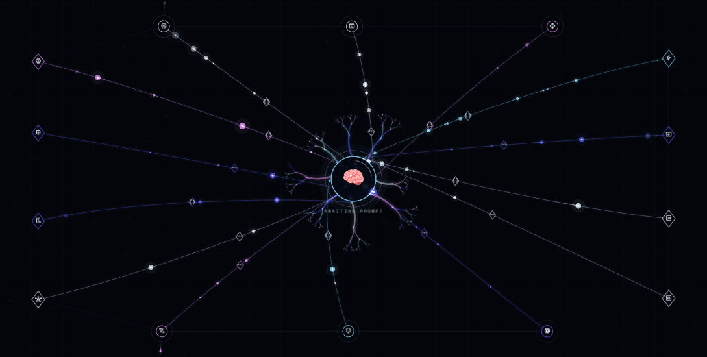

# AIConstructVisualizer

AIConstructVisualizer is a browser-based collection of abstract visual bodies for AI assistants, agents, and digital personas. It deliberately avoids faces and humanoid avatars. Thought is represented through persistent particles, neural wiring, fractal tissue, spatial geometry, and generational signals that can be controlled in real time.



The project is built with PixiJS and plain HTML, CSS, and JavaScript. There is no package installation, bundler, backend, or build step.

## Features

- seven responsive AI construct designs;
- ten smoothly blended persistent states and eight additive one-shot effects;
- particle count, speed, spread, size, palette, geometry, and behavior controls;
- pooled particles that retain stable identities through rapid state changes;
- one-way generational signals that are born, travel once, and die without allocation churn;
- pointer-reactive geometry and mobile-safe layouts;
- keyboard-accessible controls, live announcements, and reduced-motion support;
- a browser API for controlling every active visualization from application code.

## Quick start

Clone the repository and serve it over HTTP. ES modules do not run reliably from a `file://` URL.

```bash
git clone https://github.com/Denchyaknow/AIConstructVisualizer.git
cd AIConstructVisualizer
python3 -m http.server 4173 --bind 127.0.0.1
```

Open <http://127.0.0.1:4173/>.

PixiJS 8.19.0 is loaded as an ESM bundle from jsDelivr. Google Material Symbols, Syne, and Space Mono are loaded from Google Fonts, so the browser needs internet access unless those resources are vendored locally.

Any static server works. For example:

```bash
npx serve .
```

The repository can also be hosted directly on GitHub Pages, Netlify, Cloudflare Pages, or another static host. Publish the repository root; no build command is required.

## The active constructs

| Construct | Visual model | Served page |
| --- | --- | --- |
| **Dodecahedral Relay** | Twenty rotating spatial nodes and thirty neural routes. | [`dodecahedron.html`](./dodecahedron.html) |
| **Shardmind** | A deterministic irregular crystal with deforming facets and refracted signals. | [`shardmind.html`](./shardmind.html) |
| **Hyphae Intelligence** | Branching memory vessels, organelles, spores, and sap-like packets. | [`hyphae.html`](./hyphae.html) |
| **Fractal Corona** | A fragmented circular field with neural spokes and recursive signal ferns. | [`fractal-corona.html`](./fractal-corona.html) |
| **Fractal Conduit** | An inner fractal nucleus crossed by newly born, one-way neural signals. | [`fractal-conduit.html`](./fractal-conduit.html) |
| **Riven Conduit** | An uneven fractal cortex whose escaped lobes pull tendrils beyond the implied orbit. | [`riven-conduit.html`](./riven-conduit.html) |
| **Neural Frame** | A height-scaled cortex whose nodes reflow against ultrawide, square, or portrait canvas edges. | [`neural-frame.html`](./neural-frame.html) |

## Using a construct in another project

Each construct page is standalone. The simplest integration is an `iframe`:

```html
<iframe
  src="/AIConstructVisualizer/neural-frame.html"
  title="AI neural activity"
  style="width:100%;height:680px;border:0"
></iframe>
```

For a same-origin embed, the parent application can control the visualization after the frame loads:

```js
const brain = document.querySelector('iframe').contentWindow.AIBrain;
brain.setState('working');
brain.setPrompt({ emoji: '🧬', label: 'Synthesize the evidence' });
brain.trigger('insight');
```

To create a dedicated page instead, use one of the files in `js/v2/pages/` as a template. Each entry module passes a construct renderer and its configuration to the shared `bootBrain()` runtime.

Thought Singularity and Semantic Loom remain runnable in the legacy five-construct snapshot under [`archive/v2-five-constructs/`](./archive/v2-five-constructs/). The original multi-framework study is frozen under [`archive/v1-framework-study/`](./archive/v1-framework-study/).

## Continuity model

All seven active pages use the same persistent runtime in `js/v2/core.js` and `js/v2/shell.js`:

- every live signal receives an immutable ID at startup;
- state changes retarget the existing state channels with ease-in/out interpolation;
- a maximum signal pool is allocated once; particle objects and immutable IDs are never rebuilt during state or density changes;
- fast state switches begin a new ease from the current interpolated values, so there is no snap back;
- state-specific output factors and the operator multiplier determine how many preallocated signals smoothly fade into view;
- one-shot effects are additive envelopes with distinct motion signatures layered over the persistent state;
- geometry can deform continuously while particles ease toward its updated paths.

Constructs 01–04 keep each signal continuously circulating on its route. Both Conduit studies and Neural Frame use a generational mode instead: a signal is born at the center, travels from phase `0` to `1` without wrapping, fades and dies at its outer terminal, then the pooled particle later begins a new generation on a newly selected wire. This preserves smooth state transitions and avoids allocation churn without making the visible packet loop from B back to A.

Dodecahedral Relay adds a depth-sorted particle pass. Back-facing signals and trails render below the opaque prompt sphere; front-facing signals render after it, allowing neural traffic to pass both behind and across the central emoji without a physics simulation.

Use the debug API to verify the invariant:

```js
const before = AIBrain.getDebugSnapshot();
AIBrain.setState('exploring');
AIBrain.setState('guarding');
AIBrain.setState('creating');
const after = AIBrain.getDebugSnapshot();

console.assert(before.count === after.count);
console.assert(before.ids.join() === after.ids.join());
if (after.flowMode === 'loop') console.assert(after.minAlpha > 0);
if (after.flowMode === 'one-way') {
  console.assert(after.streamPhaseRange.min >= 0);
  console.assert(after.streamPhaseRange.max <= 1);
}
```

## Realtime API

Every construct exposes the same browser API:

```js
AIBrain.setState('listening');
AIBrain.trigger('insight');
AIBrain.setPrompt({ emoji: '🧬', label: 'Synthesize the evidence' });
AIBrain.setParticleMultiplier(1.4);
AIBrain.setParticleSpeed(3.5);
AIBrain.setParticleSpread(1.6);
AIBrain.setParticleSizeVariation(1.25);
AIBrain.setPalette('nebula');
AIBrain.setConstructControl('fractalDepth', 5);
AIBrain.setConstructControl('fractalVariation', 1.75);
AIBrain.setConstructControl('signalCadence', 1.8);
AIBrain.setConstructControl('cursorGravity', -0.8);
AIBrain.getState();
AIBrain.getPrompt();
AIBrain.getParticleMultiplier();
AIBrain.getParticleTuning();
AIBrain.getConstructTuning();
AIBrain.getDebugSnapshot();
```

Persistent states: `quiet`, `listening`, `understanding`, `exploring`, `resolving`, `speaking`, `working`, `creating`, `uncertain`, and `guarding`.

The tuning panel is deliberately centered on `1.00`, which preserves the original design:

- **Signal multiplier** ranges from `0.35` to `4.00`. Each state supplies its own baseline: quiet and guarding are sparse, understanding is neutral, while working and creating emit the densest fields.
- **Particle speed** ranges from `1.00` to `10.00`; `1.00` is the original movement speed. It changes phase velocity without respawning particles or clearing their trails.
- **Construct spread** ranges from `0.00` to `2.00` and means something native to each body. Dodecahedral Relay expands its spatial and depth projection, Shardmind stretches, fractures, and bows its facets, Hyphae increases branch divergence and reach, Fractal Corona expands its broken orbit and recursive field, and Fractal Conduit extends its outbound wiring. Riven Conduit deliberately magnifies the upper half of this range: maximum spread produces `1.82×` reach while also amplifying fan and curvature.
- **Size variation** ranges from `0.00` (uniform) through `1.00` (original seeded sizes) to `2.00` (a wider small-to-large distribution).

Signals fade between output levels but retain immutable IDs and continue advancing along their paths while hidden. Every tuning control changes the existing field in place.

## Fractal Corona controls

Fractal Corona adds a second realtime control layer without changing the shared particle contract:

- five selectable palettes: Arc Reactor, Nebula Bloom, Solar Forge, Viridian Ghost, and White Monolith;
- breathing amplitude, reversible orbital rotation, fragment flutter, and shard density from 8 to 32;
- a distance-weighted cursor field with adjustable reach and signed gravity, from repulsion through attraction;
- recursive fractal mode with one to four branch generations, plus an oppositional-symmetry toggle;
- hue offset, saturation, color drift rate, and a chromatic-orbit toggle;
- a stable route topology: density and fractal changes fade routes instead of remapping particle lanes.

The construct-specific API is schema-driven in `fractalCoronaConfig.customControls`. The shared shell creates the controls, validates realtime values, updates palette-aware UI colors, and exposes them through `setConstructControl()`, `setPalette()`, and `getConstructTuning()`.

One-shots are intentionally different: `recognition` converges targeting brackets, `insight` produces a starburst, `recall` reverses signals through rotating memory echoes, `dispatch` launches chevrons and accelerates flow, `correction` scans and jitters the field, `completion` draws a hexagonal circuit and check, `boundary` forms a wireframe shield sphere, and `pulse` fires a compressed shockwave. Number keys trigger the eight listed effects; Space triggers a system pulse.

## Fractal Conduit controls

Fractal Conduit reverses Fractal Corona's visual hierarchy. Recursive geometry occupies the protected inner circle while eighteen independent wires pass from the prompt core, through that nucleus, and fan into simple outer circuit terminals.

- **Fractal variation** visibly reshapes the recursion from a tight radial crystal to a wide, curled organism. It changes split angle, child-length decay, root jitter, branch curl, cross-link density, and the nucleus footprint—not merely its color or rotation.
- **Fractal depth**, nucleus radius, signed rotation, branch breathing, cross-links, and living recursion control the inner structure.
- **Wire reach**, outward fan, curvature, cursor tension, terminal forks, and proximity wiring control the outbound layer independently.
- **Signal birth cadence** controls how quickly dead packets are replaced. Each packet travels center-to-terminal once; it never wraps or reverses in this construct.
- Four palettes plus hue, saturation, and drift controls recolor the complete body in real time.

The debug snapshot exposes `spawnCount`, `deathCount`, `livingStreams`, `maxGeneration`, and `streamPhaseRange`. In one-way mode the phase range remains clamped to `[0, 1]`, while generation and lifecycle counters keep increasing.

## Riven Conduit controls

Riven Conduit keeps the center-to-edge signal logic but removes the perfect outer ring. Ten seeded roots have different anchors, lengths, curl, and breakout weights, producing compressed regions, gaps, and escaped fractal lobes around an implied circular cortex.

- **Silhouette fracture** controls radial asymmetry, open boundary gaps, uneven splits, and breakout weighting.
- **Fractal lobe reach** can drive selected recursive roots beyond the implied cortex instead of merely scaling a circle.
- **Tendril reach**, fan, scatter, curvature, and breakout bias separate the outer paths into irregular near- and far-field groups.
- The shared **Construct spread** control is nonlinear in this design. Its maximum increases reach by `82%` and fans the tendrils by up to `2.4×` before the dedicated tendril controls are applied.
- Signals retain the one-way generational lifecycle from Fractal Conduit.

## Neural Frame controls

Neural Frame treats the current canvas as part of the construct topology. Core geometry, node sizes, branch lengths, curve offsets, and spark motion use `canvasHeight × 0.37` as their base scale. Terminal coordinates are calculated separately from width and height, so an ultrawide canvas moves nodes farther apart without stretching the cortex, glyphs, or fractals.

- **Canvas-width anchoring** switches between true edge-responsive width and a compact height-locked footprint.
- **Side edge rails** and **Top / bottom rails** independently choose a horizontal rail, a full rectangular frame, or a compact radial layout.
- **Perimeter nerve** adds broken links around the frame; **Intermediate relays** adds nodes along each center-to-edge path.
- **Mirror symmetry** removes seeded offsets, while **Portrait-safe reflow** restacks rail positions when height exceeds width.
- Horizontal and vertical coverage plus proportional edge padding keep terminals a consistent distance from the canvas boundary.
- **Edge data bleed** uses a separate pool of 96 sparks. Emission is stochastic and state-weighted rather than coupled one-for-one to signal arrivals. Rate, reach, scatter, size, clustered bursts, emitting edges, and afterimages are independently controllable.

The core-to-edge neural signals remain one-way generations. Edge sparks have their own short birth, outward velocity, trail, and death lifecycle, so disabling leakage does not disturb the primary signal field.

## Design references

The collection uses [Google Material Symbols](https://developers.google.com/fonts/docs/material_symbols) as capability glyphs, not a Google brand mark. Its visual vocabulary was informed by Google Design's [Visualising AI](https://design.google/library/artistic-intelligence), Refik Anadol's data-driven spatial work documented by [MoMA](https://www.moma.org/calendar/exhibitions/5535), NASA's description of the [cosmic web](https://science.nasa.gov/mission/hubble/science/science-highlights/mapping-the-cosmic-web/), Nervous System's generative [Hyphae](https://n-e-r-v-o-u-s.com/projects/albums/hyphae-animations/content/hyphae-growth-of-the-vessel-pendant/) and [Dendrite](https://n-e-r-v-o-u-s.com/projects/albums/dendrite/) systems, and the geometry of a [regular dodecahedron](https://mathworld.wolfram.com/RegularDodecahedron.html).

## Layout and accessibility

- The canvas centers and re-fits the construct whenever its host resizes.
- On wide screens the viewport remains bounded and sticky while the expanded control deck scrolls beside it.
- Controls move below the canvas on tablets and phones.
- All controls are keyboard reachable and have visible focus states.
- State changes are announced through an `aria-live` region.
- `prefers-reduced-motion` lowers signal count, trail history, and animation tempo.
- The canvas has a descriptive accessible label; the operational controls remain normal DOM elements.

## File map

```text
AIConstructVisualizer/
├── index.html                     # construct directory
├── dodecahedron.html
├── shardmind.html
├── hyphae.html
├── fractal-corona.html
├── fractal-conduit.html
├── riven-conduit.html
├── neural-frame.html
├── css/
│   ├── index-v2.css
│   └── v2.css
├── artifacts/v2/                  # reviewed desktop and mobile captures
├── js/v2/
│   ├── core.js                    # persistence, easing, particles, trails, glyphs
│   ├── shell.js                   # Pixi runtime, UI binding, public API
│   ├── constructs/                # seven active visual bodies
│   └── pages/                     # page entry modules
└── archive/
    ├── v2-five-constructs/        # exact runnable five-design snapshot
    └── v1-framework-study/        # exact frozen multi-engine comparison
```
